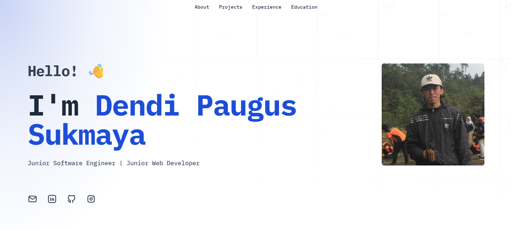

# My Portfolio

Simple Portfolio with Astro and Tailwind CSS. Thanks for your DevPortfolio Template [**RyanFitzgerald**](https://github.com/RyanFitzgerald/)

> **📬 Connect & Share!**  
> [**LinkedIn**](https://www.linkedin.com/in/dendi-paugus-sukmaya)

## Preview

To view a live preview of the site, [click here](https://dendipauguss.github.io/dps-portfolio).

## Built With

- **[Astro](https://astro.build/)** - Static site generator for modern web apps
- **[Tailwind CSS v4](https://tailwindcss.com/)** - Utility-first CSS framework
- **[Tabler Icons](https://tabler.io/icons)** - Free and open source icons
- **TypeScript** - For type-safe configuration